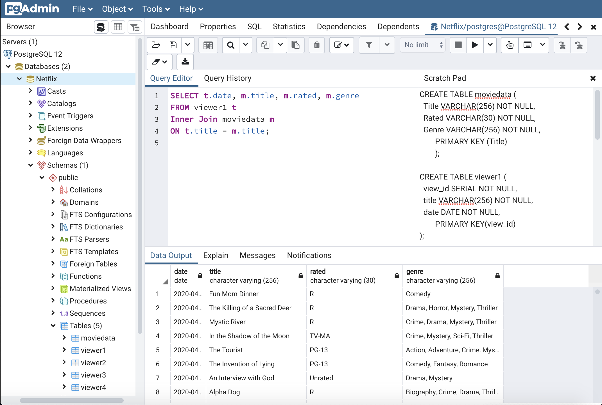

# ETL Project NETFLIX!

# Data Cleanup & Analysis

## Data Sources

We used five different datasets for our ETL Project. Four of the datasets came from the viewing histories of four different netflix viewers. We pulled the datasets directly from netflix user accounts (of family members with their permission!) as CSV files. The fifth dataset was derived from an API call to the OMDb API - The Open Movie Database.  Using user viewing data we ran through the list of Titles and inserted the Titles into the API to pull out information on the Movies from the OMBd database. 

### Data Extraxtion and Transformation

The first step was to read in the CSV files for the four users using pandas. Once we had the user viewing data into panda dataframes, we extracted only the “Title” column from each data frame and set the values to a list.  We then combined those four lists together to create one list containing all of the titles from each viewer. 

The next step was to remove duplicate values within our list. So, we converted the list into a dictionary, using the list items as keys, and converted the dictionary back into a list. This effectively removed duplicates because dictionaries cannot have duplicate keys. 

Now on to the API pull…

We set up our url parameters using the parameters from the OMBd documentation for pulling data by title. With the url string saved to a variable we ran a for loop on our title list (re-defined to movie list) and ran through the list pulling each title out and entering it to our url as a parameter and getting the title information from OMBd as json data.and appending the information to a separate list. This new list contains dictionaries of information about the Movies and is our fifth dataset. 
With our list of dictionaries we turned to pandas to create a useful dataframe out of the information we pulled. We ran a for loop to go through the json response and by calling on keys from the json data, we pulled out Title, Year, Rated, Released, Genre, and Type data and appended each to their own list that we defined prior to running the loop. To complete the loop we incorporated a Try-Except function pass Titles that had no match. (We assumed here that this effectively removed T.V. show information from our dataset since OMBd only has movie data.) The last step to setting up our Movie dataframe was to zip our lists together and create the columns names. 
After checking the return output in the data frame, we discover that the API returned one “series” or rather T.V. show, which we wanted to exclude so that we had a dataframe of only movie data. So we dropped that row. 
In anticipation of pushing our 5 dataframes to PostgreSQL, when made sure to reset indices , drop duplicate results, and take only the columns of data we wanted (title, rated, genre). And the last step before exporting to PostGreSQL was to set up our dependencies and connection to postgres!

### LOADING DATA...

*  Final production database to load the data into (relational). 

We chose to use a SQL (relational) database to load our data into because our data was already pretty structured and figured this would be the best database to be queried. There were multiple fields that could be joined on and the data was similar in function. Below is an example of our Create Table Statements and an example query statement.

### Final Database

* Our final (Netflix) Database contained 5 tables in postgres (moviedata, viewer1, viewer2, viewer3 ,viewer 4. 

## Source Data
* https://www.netflix.com/
* http://www.omdbapi.com/
